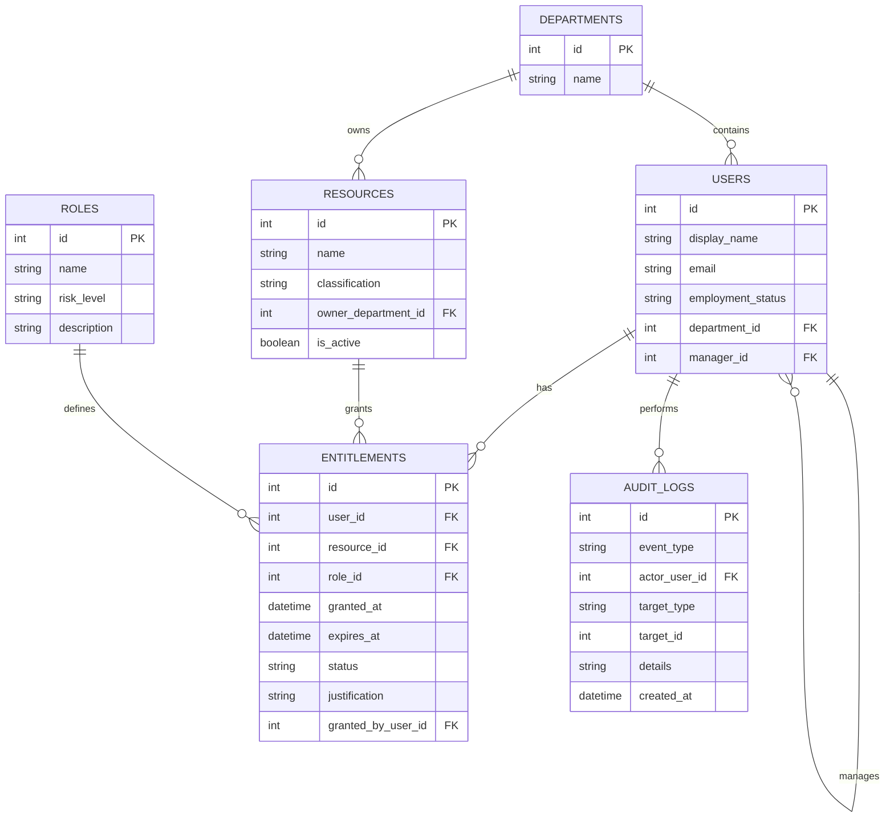

# 04 — Data Model

## Goal
Define a relational model that supports IAM access review, policy evaluation, entitlement revocation, and auditability with minimal but clear structure.

## Entities (MVP)
Exactly six core entities:
- Department
- User
- Resource
- Role
- Entitlement
- AuditLog

## ER Diagram


## Table Definitions and Constraints

### departments
- `id` (PK)
- `name` (required, unique)

### users
- `id` (PK)
- `display_name` (required)
- `email` (required, unique)
- `employment_status` (required enum)
- `department_id` (required FK -> departments.id)
- `manager_id` (optional FK -> users.id)

### resources
- `id` (PK)
- `name` (required, unique in MVP)
- `classification` (required enum: Internal, Confidential, Restricted)
- `owner_department_id` (required FK -> departments.id)
- `is_active` (required boolean)

### roles
- `id` (PK)
- `name` (required, unique)
- `risk_level` (required enum)
- `description` (optional text)

### entitlements
- `id` (PK)
- `user_id` (required FK -> users.id)
- `resource_id` (required FK -> resources.id)
- `role_id` (required FK -> roles.id)
- `granted_at` (required datetime)
- `expires_at` (required datetime in MVP data policy)
- `status` (required enum: Active, Revoked)
- `justification` (optional text)
- `granted_by_user_id` (required FK -> users.id)

### audit_logs
- `id` (PK)
- `event_type` (required enum)
- `actor_user_id` (required FK -> users.id)
- `target_type` (required string)
- `target_id` (required int)
- `details` (required text)
- `created_at` (required datetime)

## Index Strategy
- Unique: `users.email`
- Index: `entitlements.user_id`
- Index: `entitlements.resource_id`
- Index: `entitlements.status`
- Index: `audit_logs.actor_user_id`
- Index: `audit_logs.created_at`
- Unique: `departments.name`
- Unique: `roles.name`
- Unique (MVP): `resources.name`

## Why these indexes
- Access review views commonly filter by user and status.
- Audit views are usually time-sorted and actor-filtered.
- Uniqueness protects business identity and prevents accidental duplicates.

## ORM and Migration Flow
```text
SQLAlchemy ORM models
-> SQLAlchemy metadata
-> Alembic autogenerate
-> migration file review
-> alembic upgrade
-> SQLite schema
```

## Seed Data Requirements (for policy demo)
- 4 departments
- 8 users
- 5 resources
- 6 roles
- 15 entitlements
- at least 1 prior audit log

Seed data must include:
- 1 expired active entitlement
- 1 inactive user with active entitlement
- 1 user with both Finance Reader and Finance Approver
- 1 user with 3 active restricted entitlements
- 1 normal user with valid access only

## Interview Readiness Notes
Be ready to explain:
1. Why entitlement is the central IAM governance object.
2. Why audit logs are append-only in MVP.
3. Why domain entities are separate from ORM models.
4. How constraints and indexes enforce quality and performance.
