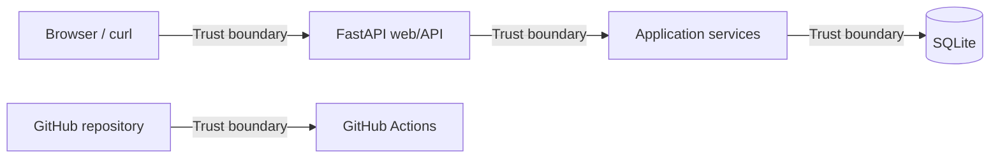

# 05 — Threat Model

## Objective
Identify realistic security threats for the IAM Access Review MVP and map them to concrete mitigations and tests.

## Method
Lightweight STRIDE-inspired analysis with emphasis on:
- protected assets,
- trust boundaries,
- abuse paths,
- practical controls appropriate for MVP scope.

## Protected Assets
- User identities and employment status
- Roles and entitlements
- Resource classification data
- Policy rules and findings
- Audit logs
- Administrative revoke actions
- Database integrity
- CI pipeline configuration
- Secrets and tokens

## Actors
- Admin / IAM Reviewer
- Regular user
- Unauthorized user
- Developer
- CI pipeline

## Trust Boundaries

## STRIDE Threat Table

| Category | Threat | Example | Mitigation | Planned Test |
|---|---|---|---|---|
| Spoofing | Fake admin identity | Non-admin calls admin endpoint | `CurrentUserProvider` + `AuthorizationService` | `non_admin_cannot_revoke_entitlement` |
| Tampering | Unauthorized state change | Manipulated entitlement ID in revoke request | Guard clauses + ownership/authorization checks in use case | `unauthorized_revoke_is_denied` |
| Repudiation | Denying performed action | Admin denies revocation action | Append-only audit event for revoke | `revoke_creates_audit_log` |
| Information Disclosure | Unauthorized read access | Non-admin views audit logs | Authorization check before data retrieval | `non_admin_cannot_view_audit_log` |
| Denial of Service | Excessive request volume | Repeated expensive review calls | Documented future rate limiting (out of MVP) | Not in MVP |
| Elevation of Privilege | Privilege gain by endpoint abuse | Direct call to revoke endpoint by standard user | Centralized authorization in application layer | `user_cannot_revoke` |
| Supply Chain | Vulnerable dependencies | Known CVE in Python package | `pip-audit` in CI | CI job |
| Secret Leakage | Secret committed to repository | Token/API key pushed to git | `.env.example` + `gitleaks` in CI | CI job |

## Threat Priorities (MVP)
Top-priority controls:
1. Authorization for revoke and audit read.
2. Mandatory audit event on critical state changes.
3. Input and state validation with guard clauses.
4. CI-based dependency and secret scanning.

## Residual Risk and Explicit MVP Limits
Accepted in MVP (documented, not ignored):
- No real login / MFA
- No rate limiting
- No centralized immutable log sink
- No secrets manager integration
- No external HR source of truth

These are tracked for future production hardening.
